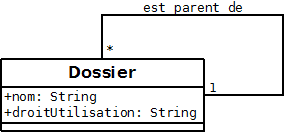

# index

Nous allons définir une salle de classe, composée d'un enseignant et d'étudiants.

## Classe

Un professeur ou un étudiant est une personne qui porte un nom et un prénom.  
La classe est l'entité que l'on va décrire.  
On définit le nom, les propriétés et les méthodes. En UML, on parle de nom, attribut et opération. 

* La zone supérieure contient le nom de la classe. Deux classes ne peuvent pas avoir le même nom.  
* La zone du milieu décrit les attributs : le nom, et le prénom
* On ne met pas les attributs typé par une autre classe. C'est la relation qui s'en charge.
* La zone inférieure contient les opérations. On ne met que les opérations visibles \(public\).
* Le `+` indique un élément visible \(public\), le `-` indique un élément caché \(private\)

## Héritage

L'étudiant est une personne qui a des spécificités.  
L'héritage consiste à regrouper dans une classe toutes les attributs et opérations communs à plusieurs classes. On parle aussi de généralisation.  

* On utilise une flèche, dont la pointe est un triangle vide.
* la direction de la flèche indique que la classe Etudiant hérite de la classe Personne.

## Les relations

Une relation est une relation entre 2 classes. On utilise que les relations binaires.  
N'utilisez pas les relations n-aires, elles sont trop complexes à lire et seront difficiles à traduire dans un langage.  

### Le nom

On nomme une relation pour une meilleure compréhension du schéma \(ici : rentre\).

### La cardinalité

La cardinalité quantifie la relation entre 2 instances \(objets\) de 2 classes.  
Il existe des cardinalités minimales et des cardinalités maximales.

* 0 signifie une relation optionnelle. La cardinalité maximale ne peut pas avoir cette valeur.  
* 1 signifie une relation unitaire.
* \* signifie une relation multiple \(parfois on utilise la lettre n\).
* On écrit toujours la cardinalité près la classe valorisée
  * Un étudiant rentre toujours dans une salle \(1..1\)
  * Une salle contient plusieurs étudiants, mais peut être vide \(0..\*\)
* Souvent vous ne verrez que la cardinalité maximale. Ici \(\*,1\)

### La direction

La relation peut être unidirectionnelle ou bidirectionnelle. Elle apporte la notion de navigabilité.  
Elle indique quelle classe contient la 2ème classe. Ce sera utile pour écrire le code.  
Une relation unidirectionnelle est représentée par une flèche.  
Par défaut une relation est bidirectionnelle.

* A -&gt; B : A stocke B. B ne connaît pas A.
* A &lt;- B : B stocke A. A ne connaît pas B.
* A &lt;-&gt; B : A stocke B, et B stocke A.  
* ici, c'est l'étudiant qui connaît sa classe. La classe ne connaît pas l'étudiant.

### Remarque

Lorsque l'on a ajouté la relation _rentre_, on n'a pas ajouté d'attribut salle dans la classe Etudiant. C'est la relation qui indique l'information. En Java cela se traduira par une propriété `Salle salleDeCours;`, mais ici on est en UML.

### Relation 1 1

Ici, quand on dit 1 1, on évoque les cardinalités maximales.  
Relation entre Etudiant et Adresse :  

Une relation 1 1 signifie que :

* une instance d'une classe A correspond une seule instance dans la classe B
* une instance d'une classe B correspond une seule instance dans la classe A \(vice versa\).  
* un étudiant a une adresse. L'adresse appartient à un seul étudiant, et ne peut exister sans l'existence de l'étudiant.

### Relation 1 \*

Relation entre Professeur et Cours :

Une relation 1 \* signifie que :

* une instance de la classe A peut avoir plusieurs instances dans la classe B.  
* une instance de la classe B peut avoir une seule instance dans la classe A.  
* Un professeur enseigne dans plusieurs cours. Un cours est fait par un  seul professeur.

### Relation \* \*

Relation entre Etudiant et Cours :

* une instance de la classe A peut avoir plusieurs instances dans la classe B.  
* une instance de la classe B peut avoir plusieurs instance dans la classe A.  
* Un étudiant assiste à plusieurs cours. Un cours contient plusieurs étudiants.  

Une relation \* \* sera remplacée par 2 relations 1 \*, si cette relation justifie la création d'un attribut.

* Un étudiant participe à un cours, il devient un participant
* Le participant a une place
* Un étudiant devient plusieurs fois un participant
* Un participant est un étudiant
* Un cours a plusieurs participants
* Un participant assiste à un seul cours

### Relation réflective

* C'est une relation où la classe a une relation avec elle même.  
* Cette relation est très utilisée pour représenter une arborescence.  
* Par exemple, un dossier est contenu dans un dossier parent.  

## Agrégation

C'est une relation qui a une notion de subordination

  
Une voiture possède un moteur. Si on détruit la voiture, le moteur peut être ré-utiliser.

## Composition

C'est une relation qui a une notion d'appartenance.  
C'est une aggrégation qui a un lien plus poussé.  
Une instance de la classe B ne peut exister sans la présence d'une instance de la classe A.

  
Une matière est composée de plusieurs cours. Si la matière disparaît, le cours aussi.

## Schéma global

 Un exemple de modélisation d'un enseignement.  
Ce qu'il faut lire :

* un professeur est une personne.
* un étudiant est une personne et possède une adresse.
* un professeur enseigne plusieurs dans plusieurs cours.
* un étudiant participe à plusieurs cours en étant participant
* Si un étudiant est supprimé, le participant aussi
* un cours se passe dans une salle
* un cours contient plusieurs participants.

## ce qu'il faut savoir

* Un diagramme des classes est un schéma. Il doit être facile à lire.
* Plus le schéma est complexe, plus votre application sera complexe.
* Pour modéliser simplement, il faut aller à l'essentiel.  
* Plus il y a de classes, plus il y aura de code à écrire.
* Une entité doit être bien nommée pour bien comprendre la signification du schéma.  
* Une entité est une classe. Souvent en conception, on le confond avec l'objet.  
* Pour relier les classes entre elles, on utilise les relations ou l'héritage.  

